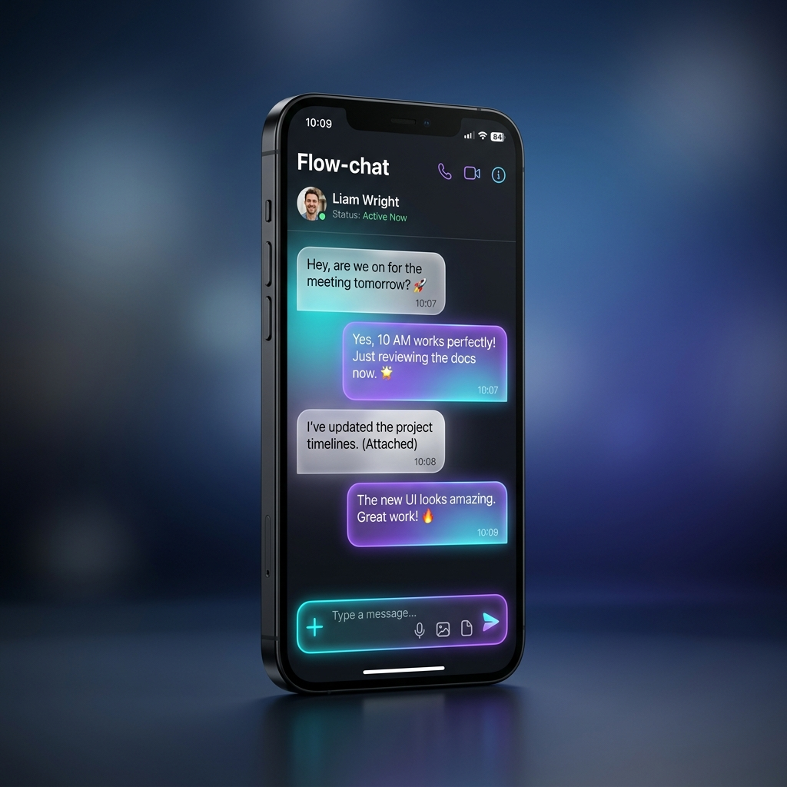
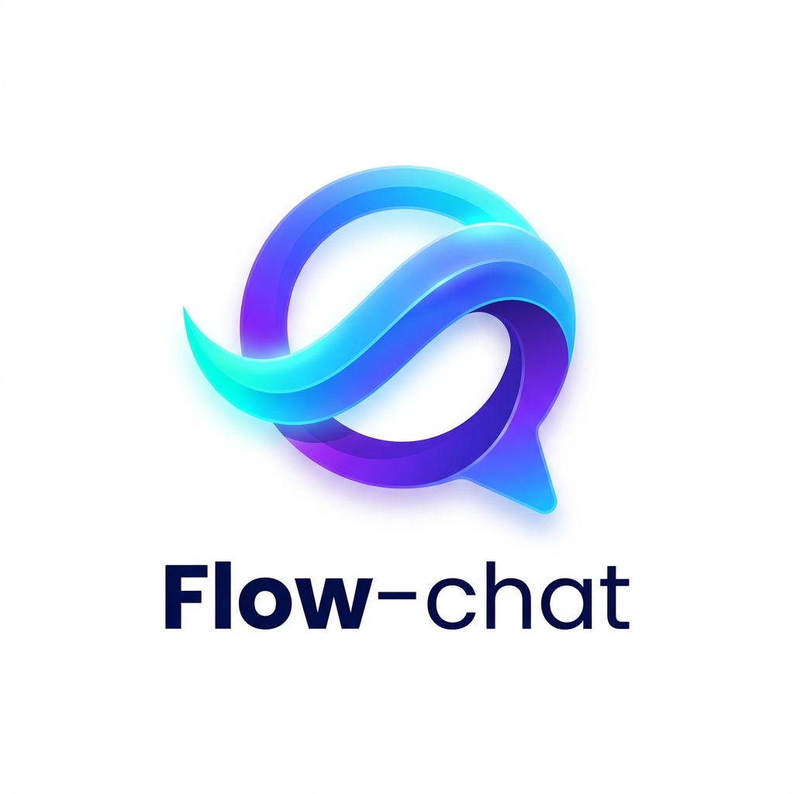

# Flow-chat 🚀

<p align="center">
  
</p>

<p align="center">
  <b>La experiencia definitiva de mensajería en tiempo real.</b>
</p>

---

<p align="center">
  
  
  
  
</p>

## ✨ Rediseño Visual (V2)

Hemos actualizado la identidad visual de **Flow-chat** para reflejar una estética más moderna y fluida. La interfaz ahora cuenta con un sistema de tokens centralizado para colores y tipografía.

| Nuevo Logo | Concepto |
| :---: | :--- |
|  | **Identidad Dinámica**: Combinación de una burbuja de chat minimalista con ondas que representan el flujo constante de comunicación. |

---

## 📸 Screenshots & Showcase

Aquí puedes visualizar el flujo de la aplicación. Para añadir tus propias capturas, reemplaza las rutas en los placeholders de abajo:

<div align="center">

| Bienvenida | Login | Registro |
| :---: | :---: | :---: |
|  |  |  |

| Bandeja de Entrada | Pantalla de Chat | Perfil |
| :---: | :---: | :---: |
|  |  |  |

</div>

> [!TIP]
> Para usar tus propias capturas, guárdalas en la carpeta `assets/screenshots/` con los nombres correspondientes o edita las rutas en el archivo `README.md` (líneas 37-43).

---

## 📱 Sobre el Proyecto

**Flow-chat** no es solo una app de mensajería; es un ecosistema diseñado para la velocidad y la simplicidad. Desarrollada con las mejores prácticas de la industria, aprovecha el renderizado de alto rendimiento de **Flutter** y la escalabilidad de **MongoDB**.

### 🎯 Pilares del Proyecto
- **Fluidez**: Transiciones a 60fps y una UI intuitiva.
- **Seguridad**: Autenticación síncrona y transparente.
- **Robustez**: Backend verificado con suites de pruebas extensas.
- **UI Premium**: Diseño centrado en el usuario con una paleta de colores vibrante y moderna.

---

## 🚀 Características Principales

- **⚡ Mensajería Instantánea**: Web sockets optimizados para baja latencia.
- **🎨 Design System**: Estilos centralizados en `AppColors` y `AppTextStyle`.
- **🔐 Auth Engine**: Sistema seguro de login y registro.
- **☁️ Sync Cloud**: Todos tus chats siempre actualizados con MongoDB.
- **🛠️ Cleaner Architecture**: Código modular y extensible para facilitar el escalado.

---

## 🛠️ Cómo cambiar el Logo de Inicio

Para actualizar el icono de la aplicación en todas las plataformas (Android, iOS, Web) sigue estos pasos:

1.  Reemplaza `assets/icons/app_icon.png` con tu nueva imagen.
2.  Asegúrate de que `pubspec.yaml` tenga configurado el `flutter_launcher_icons`.
3.  Ejecuta los siguientes comandos en tu terminal:

```bash
flutter pub get
flutter pub run flutter_launcher_icons
```

---

## 🏁 Instalación Rápida

1.  **Clonar:** `git clone https://github.com/tu-usuario/Flow-chat.git`
2.  **Dependencias:** `flutter pub get`
3.  **Correr:** `flutter run`

---

<p align="center">
  Desarrollado con ❤️ por <b>Victor</b> | 2026
</p>
